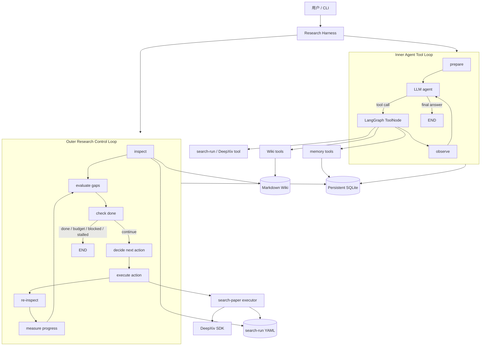

# Auto Paper Research：系统架构与实现说明

本文档说明当前仓库的技术选型、模块职责、数据结构、端到端流程，以及
Research Harness 的内外循环设计。

当前版本可以概括为：

> 以 Markdown/YAML Wiki 为领域知识真源，以确定性 Python 工具完成搜索、
> 解析、索引和校验，以 LangGraph 编排 Agent 工具循环与研究控制循环，
> 并使用项目目录中的 SQLite 保存 checkpoint 和显式研究记忆。

当前自动执行边界也需要先说明：

- 新增独立 Fast Research Loop，可在不执行 Full Ingest 的情况下完成多源检索、
  两级阅读、EvidenceCard 抽取、非共识判断和确定性 Markdown 综述；
- Fast Loop 不写 Wiki，人工批准的 `PromotionManifest` 才进入现有 Durable Evidence Loop；

- Wiki 查询、索引、关系解析和校验已经实现；
- DeepXiv 检索、归一化、去重、search-run 回写和验证已经实现；
- Outer Research Loop 可以检查研究状态、计算 Gap、判断 Done，并执行后重新观察真源；
- `search` 已覆盖 gap-directed query planning、DeepXiv、候选筛选和 selected handoff；
- `ingest` 已覆盖受控 arXiv PDF 交接、结构化抽取、shadow validation 和原子 Wiki 发布；
- `verify` 已覆盖页码/数值/关系预检、语义复核和 guarded lifecycle transition；
- `analyze_claims` 已覆盖 verified evidence 的条件对齐和 non-consensus assessment；
- 任意 JavaScript 网页浏览、HTML 前端和自动 PPT synthesis 不属于 Review V1；
  Markdown 科研综述 synthesis 已实现。

## 1. 系统目标

首期研究主题是：

> 稀疏化模型在长上下文领域的性能与瓶颈。

系统不是一次性调用 LLM 生成综述，而是把调研拆成可检查、可恢复、可循环优化的过程：

1. 规划可追踪的论文检索；
2. 保存候选论文及每次发现它们的查询来源；
3. 将论文内容沉淀为结构化 Wiki 实体；
4. 将实验条件、数值结论和证据位置分开保存；
5. 区分候选论文覆盖和真实证据覆盖；
6. 根据未覆盖问题选择下一步动作；
7. 使用完成门槛、搜索饱和度和阻塞 Gap 控制停止；
8. 将重复失败写入 Error Book，再反向修改 Skill 或确定性脚本。

## 2. 核心设计原则

### 2.1 Markdown 是知识真源

论文、方法、实验、Claim、Benchmark、模型和非共识评估都以 Markdown 文件保存。
JSON 索引只是可重建缓存，SQLite 也不代替研究知识本身。

### 2.2 Skill 是操作协议，不是知识页面

`SKILL.md` 规定 Agent 应该怎样搜索、读取、写入和自检；Wiki 页面保存执行这些
流程后得到的研究知识。一篇论文不是一个 Skill。

### 2.3 确定性逻辑优先

能通过普通代码稳定完成的工作不交给 LLM，例如：

- YAML/Markdown 解析；
- ID、路径和 schema 校验；
- 论文标识符归一化与去重；
- coverage、数量门槛和完成条件计算；
- 工具输出截断、Token 脱敏和网络权限检查；
- 同一 `(gap, action)` 的尝试次数及无进展统计。

LLM 主要负责自然语言理解、语义判断和在工具之上的综合，不负责伪装成数据库或规则引擎。

### 2.4 发现元数据不等于科学证据

DeepXiv 搜索结果只能形成 candidate coverage。只有被摄取到 Wiki、保留证据定位，
并达到相应生命周期状态的 paper、experiment 和 claim 才能形成 evidence coverage。

### 2.5 运行状态和领域状态分离

- Wiki：论文领域知识；
- search-run YAML：检索过程与候选集；
- SQLite Checkpointer：线程运行状态；
- SQLite Store：跨线程的简短研究记忆；
- Error Book：重复失败和流程改进建议。

## 3. 技术栈

| 层级 | 技术 | 当前用途 |
|---|---|---|
| 语言与运行时 | Python 3.13 | CLI、编排、Wiki Engine、脚本和测试 |
| Agent 接口 | LangChain 1.3 | 模型初始化、消息模型、Tool 定义与绑定 |
| 工作流编排 | LangGraph 1.2 | Inner Tool Loop、Outer Research Loop、条件路由 |
| Checkpoint | `langgraph-checkpoint-sqlite` | 保存 LangGraph thread checkpoint |
| 跨线程记忆 | LangGraph `SqliteStore` | 保存显式、去重的研究笔记 |
| 本地数据库 | SQLite | 同一持久化文件中保存 checkpoint 和 store 数据，盘符由用户选择 |
| 数据契约 | Pydantic 2 | 严格验证 Snapshot、Gap、Decision、ActionResult、DoneCriteria |
| 配置和过程记录 | PyYAML | Wiki frontmatter、schema、search-run、DoneCriteria |
| 知识存储 | Markdown + YAML frontmatter | 人可读、Git 可审计的 Wiki 真源 |
| 可重建索引 | JSON | entities、edges、aliases、backlinks、diagnostics、stats |
| 学术检索 | DeepXiv SDK + Semantic Scholar Graph REST | DeepXiv 发现；S2 仅对入选论文做轻量元数据补充 |
| 来源资格 | 确定性域名策略 + 分阶段漏斗 | 聚合镜像仅导航；Deep Read 优先原始论文和一手官方资料 |
| 模型适配 | `langchain-openai` | 当前 OpenAI Chat Model 适配器 |
| CLI | Python `argparse` | doctor、run、research、skills、Wiki 等命令 |
| 测试 | Python `unittest` | Harness、Wiki Engine、搜索脚本回归测试 |

`deepxiv-sdk` 当前单独安装在 Conda `(base)` 环境，不需要 DeepXiv MCP。

## 4. 总体架构



系统中有两个不同的循环：

- Inner Loop 面向一次对话任务，由模型选择工具；
- Outer Loop 面向整个调研项目，根据可计算的研究状态决定下一步。

## 5. 项目目录结构

```text
auto-paper-research/
├── research_harness/                 LangChain/LangGraph Harness
│   ├── graph.py                      Inner Agent Tool Loop
│   ├── research_control.py           Outer Research Loop
│   ├── research_evaluation.py        Snapshot、Gap、Done、Progress
│   ├── research_execution.py         有限动作执行器
│   ├── research_models.py            Pydantic 领域契约
│   ├── ingest_models.py              论文摄取结构化契约
│   ├── paper_ingest.py               PDF 提取、Draft 编译、Wiki 发布
│   ├── search_runtime.py             Query planning 与候选筛选
│   ├── paper_sources.py              受控 arXiv PDF 获取
│   ├── evidence_verification.py      证据复核和状态晋升
│   ├── evidence_revision.py          受限证据修订和复验交接
│   ├── nonconsensus_analysis.py      Claim 条件对齐与 Assessment
│   ├── skill_registry.py             Skill 注册表
│   ├── tools.py                      LangChain Tool 封装
│   ├── persistence.py                SQLite checkpoint/store
│   ├── memory.py                     显式跨线程记忆
│   ├── config.py                     配置与持久化路径校验
│   ├── state.py                      LangGraph state/context
│   ├── prompts.py                    Agent 系统规则
│   ├── cli.py                        Harness CLI
│   └── tests/                        Harness 回归测试
│
├── tools/wiki/                       确定性 Wiki Engine
│   ├── parser.py                     Markdown/frontmatter/wikilink 解析
│   ├── schema.py                     schema 和 relation 配置加载
│   ├── resolver.py                   ID、别名、标题、旧路径解析
│   ├── indexer.py                    实体、边、反向链接和 JSON 索引
│   ├── query.py                      搜索、邻居、关联和结构化实验查询
│   ├── validator.py                  schema、关系和证据策略校验
│   ├── writer.py                     Shadow 校验、原子发布与回滚
│   ├── models.py                     Wiki 数据结构
│   └── __main__.py                   Wiki CLI
│
├── skills/
│   ├── search-paper/
│   │   ├── SKILL.md                  检索操作协议
│   │   ├── references/               检索策略、DeepXiv、输出 schema
│   │   ├── assets/                   search-run 模板
│   │   ├── scripts/                  建 run、执行检索、归一化、验证
│   │   └── agents/                   Skill 元数据
│   ├── ingest-paper/                 论文摄取与证据提取协议
│   ├── verify-evidence/              来源复核与生命周期协议
│   ├── revise-evidence/              矛盾与 locator 修订协议
│   └── analyze-claims/               非共识比较协议
│
├── wiki/                             领域知识真源
│   ├── papers/                       论文实体
│   ├── methods/                      方法实体
│   ├── experiments/                  实验实体
│   ├── claims/                       结论实体
│   ├── concepts/                     概念实体
│   ├── benchmarks/                   Benchmark 实体
│   ├── models/                       模型实体
│   ├── assessments/                  非共识评估实体
│   ├── _meta/                        schema、relation、模板
│   └── _generated/                   可重建 JSON 索引，不提交
│
├── research/                         每个调研主题的过程状态
│   └── long-context-sparse-models/
│       ├── scope.md                  范围、研究问题、排除项
│       ├── done-criteria.yaml         完成条件和预算
│       └── search-runs/              查询、候选集、coverage、错误
│
├── sources/                          本地论文 PDF 等原始材料
├── error_book/                       重复失败和循环改进记录
├── docs/                             系统文档
├── .harness/                         本地 SQLite 和缓存，不提交
├── .env.example                      非秘密配置示例
└── requirements-harness.txt          Harness 固定依赖
```

空的 Wiki 实体目录会在产生对应实体时出现；schema 已经支持全部八类实体。

## 6. Research Harness 内部结构

### 6.1 `config.py`：配置和存储安全

`HarnessSettings` 集中保存仓库路径、模型、workspace、上下文预算、最大工具轮数和
输出长度。`resolve_database_path()` 会拒绝：

- `:memory:`；
- 非 `.db`、`.sqlite`、`.sqlite3` 后缀。

数据库可以位于任意可写盘符；相对路径默认解析到当前仓库。

默认 SQLite 位于：

```text
<当前仓库>/.harness/research-harness.sqlite3
```

### 6.2 `state.py`：三种状态边界

`HarnessState` 保存一次 Agent thread 的消息和工具循环计数；`HarnessContext` 是一次
调用不可变的 runtime context，只包含 `workspace_id` 与 `allow_network`；
`ResearchState` 保存外层研究循环的快照、Gap、Decision、ActionResult、尝试历史和预算。

论文知识本身不写入这些 state，而是留在 Wiki/search-run 真源中。

### 6.3 `persistence.py`：SQLite 持久化

一个 SQLite 文件使用两条独立连接：

- `SqliteSaver`：LangGraph checkpoint；
- `SqliteStore`：跨 thread 研究记忆。

连接启用 WAL、foreign keys、busy timeout 和 `synchronous=NORMAL`。这样既保持实现简单，
又让多个 thread 的 checkpoint 与 memory 可以共享一个本地数据库。

### 6.4 `memory.py`：最小显式记忆

记忆只允许四种类型：

- `observation`；
- `decision`；
- `preference`；
- `open-question`。

文本、topic、kind 和 evidence IDs 经过 SHA-256 生成稳定 key；重复保存会增加
`confirmations` 而不是创建重复记录。带 evidence ID 的记录标记为 `grounded`，否则只能是
`unverified-note`。

召回使用轻量关键词匹配和时间排序，不引入向量数据库。中文查询额外生成双字词片段，
每次最多向模型注入少量高相关记忆。

### 6.5 `skill_registry.py`：SkillRegistry

Registry 只扫描直接位于 `skills/*/SKILL.md` 的 Skill 包，并执行：

- YAML frontmatter 解析；
- `name`、目录名和 kebab-case 一致性校验；
- `references/`、`assets/`、`scripts/`、`agents/` 文件登记；
- UTF-8、文件大小和路径穿越防护；
- supporting resource 按需读取。

它不是智能 Skill Router，也不会看到一个目录就自动执行其中脚本。当前 Outer Loop 使用显式
映射 `search -> search-paper/scripts/deepxiv_search.py`。

### 6.6 `tools.py`：LangChain Tool 层

该模块把确定性能力包装为十个 LangChain Tool：

| Tool | 作用 |
|---|---|
| `wiki_search` | 按文本、类型、状态和年份搜索实体 |
| `wiki_show` | 通过 ID、标题、别名或旧路径读取实体 |
| `wiki_related` | 遍历有限深度的 typed relation 图 |
| `wiki_experiment_query` | 按 Benchmark、方法、模型、上下文和稀疏度查询实验 |
| `wiki_validate` | 检查 schema、ID、链接、关系和证据政策 |
| `wiki_stats` | 汇总实体、关系、链接和诊断 |
| `search_run_status` | 读取检索批次、查询状态、候选和 coverage |
| `deepxiv_search_run` | 预览或执行已有 query plan |
| `remember_research_memory` | 保存显式跨线程研究笔记 |
| `recall_research_memory` | 检索当前 workspace 的研究笔记 |

所有工具输出都会在进入模型上下文前转成有长度上限的 JSON。DeepXiv 子进程输出会再次执行
Token 脱敏。

### 6.7 `graph.py`：Inner Agent Tool Loop

Inner Loop 是常规的 LangGraph ReAct 式工具循环：

```text
START
  -> prepare
  -> agent
      -> 没有 tool call -> END
      -> 有 tool call   -> ToolNode
                            -> observe
                            -> agent
```

`agent` 节点执行以下上下文管理：

1. 从 checkpoint 读取 thread 消息；
2. 用 `trim_messages(strategy="last")` 按 token budget 保留最近消息；
3. 根据最近的人类问题召回最多 8 条研究记忆；
4. 动态生成 system prompt；
5. 将 Tool schema 绑定到 Chat Model；
6. 达到最大工具轮数时禁止继续调用工具并要求直接综合。

`ToolNode` 统一捕获工具异常，`observe` 节点统计工具失败和最近使用的工具。

### 6.8 `research_models.py`：严格领域契约

所有控制对象均使用 `extra="forbid"` 且 frozen 的 Pydantic Model：

- `ResearchSnapshot`：从真源计算的当前研究状态；
- `ResearchGap`：可操作的知识缺口，可显式标记 `blocking`；
- `ResearchDecision`：有限动作和目标 Gap；
- `ResearchActionResult`：执行状态、结果语义、修改来源和指标；
- `ActionAttemptStats`：同一 Gap/Action 的尝试、失败和无进展次数；
- `NonConsensusAssessment`：非共识研究产物契约；
- `DoneCriteria` / `DoneCheck`：完成条件与检查结果；
- `ProgressMeasurement`：前后快照差异和加权 `progress_score`。

`search`、`ingest`、`revise_evidence`、`analyze_claims`、`expand_citations` 和 `verify` 必须指定
`target_gap_id`，避免产生没有研究目标的动作。

`ingest_models.py` 进一步定义论文摄取边界：

- `PaperIngestDraft`：模型唯一允许返回的根对象；
- `EvidenceLocator`：PDF 页、论文页、章节、表图和证据描述；
- `MethodDraft` / `BenchmarkDraft` / `ModelDraft`：可复用实体候选；
- `ClaimDraft` / `ExperimentDraft`：原子结论、条件和跨引用；
- `PaperDocument` / `PaperExcerpt` / `PaperIngestResult`：PDF 输入、受限上下文和执行结果。

这些对象同样 `extra="forbid"`。experiment 引用不存在的 local key、located claim 没有
locator、或 experiment-supported claim 没有实验边，都会在调用 Writer 之前失败。

### 6.9 `research_evaluation.py`：研究状态计算

该模块完全不调用 LLM，主要分为五步：

1. `inspect_research()`：读取 Wiki 和全部 search-run，计算 Snapshot；
2. `evaluate_gaps()`：按 DoneCriteria 生成并排序 Gap；
3. `check_done()`：检查 coverage、quality、saturation、blocking gap 和预算；
4. `measure_progress()`：比较两次 Snapshot 的实体及证据增量；
5. `decide_next_action()`：在有限动作集合中选择一个下一步。

其中最关键的 coverage 分离是：

```text
candidate_facet_coverage
    = search-run 是否已经发现相关候选论文

evidence_facet_coverage
    = Wiki 是否已有相关 paper / experiment / claim 证据
```

Gap 路由规则：

| Candidate | Evidence | 下一动作 |
|---|---|---|
| missing | missing | `search` |
| partial/covered | missing | `ingest` |
| partial/covered | partial | `verify` |
| 任意 | 满足要求 | 该 facet 不再产生 coverage gap |

### 6.10 `research_execution.py`：有限动作执行器

`DeterministicActionExecutor` 不使用 LLM Router。当前显式支持五条路径。

`search`：

1. 优先执行目标 Gap 已绑定的 planned query；
2. 没有计划时，用 `search-paper` 和严格 Draft 生成最多 4 个 follow-up query；
3. 在写入前运行 search-run validator，并原子发布新 round；
4. 检查网络授权、`DEEPXIV_TOKEN` 和 SDK；
5. 通过 SkillRegistry 找到注册的 `deepxiv_search.py`；
6. 使用当前 Python 解释器启动参数数组形式的子进程；
7. 对 metadata/abstract 做结构化五维筛选，并确定性选择最多 3 个 core handoff；
8. 计算运行前后的 query、candidate、triage 和 selection 增量。

成功但没有新增候选会记录为 `negative_research_result`，和工具故障严格区分。

`ingest`：

1. 只选择 `review_state: selected-for-ingest` 的 candidate；
2. 优先使用显式、安全的仓库相对 `local_pdf_path`；
3. 对缺少本地源的 arXiv handoff，在网络获准后限制 host、大小、PDF header 和项目内目标目录获取；
4. 调用 `PaperIngestPipeline`，不让模型直接写 Markdown；批量首轮可用 deferred 模式跳过 Wiki catalog 注入；
5. 若 `PaperIngestDraft` 校验失败，仅以原输出做一次有界 schema repair；无效输出、字段级错误和 repair 结果写入非发布 semantic artifact；
6. 将实际模型调用数、repair 状态、变更页面和实体数写入 `ResearchActionResult`；
7. deferred 模式先把经过 Schema 校验的草稿写入 content-addressed queue，并把
   candidate 改为 `staged-for-wiki`，此时 Wiki source hash 必须不变；
8. 独立 `publish-staged` 阶段才读取当前 Wiki、完成实体消歧、shadow validation 和原子发布；
9. Wiki 发布成功后把 candidate 关闭为 `ingested`，记录 canonical paper ID、时间、页面和 diagnostics；
10. 重建 Snapshot，让 Outer Loop 只承认真源中实际出现的增量。

`verify`：

1. 找到 ingested paper 和 search-run 中保留的本地 PDF；
2. 构造 paper、method、model、benchmark、experiment、claim 的关系闭包；
3. 确定性检查 locator 页码、实验数值可见性和 Claim evidence edge；
4. 模型逐实体返回 `supported / contradicted / insufficient`；
5. 只有语义结果和确定性 gate 同时通过的实体才变为 `verified`；
6. assessment verification 还要求所有输入 claim/experiment 已 verified。

`revise_evidence`：

1. 只选择 `needs-review` 的 method/claim，且 verifier 必须已记录 source hash、页码、verdict 和 rationale；
2. 只接受 `source-contradiction / locator-page-mismatch / invalid-locator`；
3. locator 问题只能改 `evidence`，method 矛盾只能改 `definition/evidence`，claim 矛盾只能改 `statement/scope/evidence`；
4. 模型只能引用本次提供的 PDF 页，runtime 再校验 entity、paper、reason、hash、页码和字段 allow-list；
5. 发布时把旧 verification 写入 `revision_history`，状态固定回到 `draft`；
6. 每个实体最多两轮修订，之后形成 blocking human-review gap；修订动作永远不能自行标记 verified。

`analyze_claims`：

1. 只检索 verified claim 及其 verified experiment；
2. 比较 method、model、benchmark、context、metric、sparsity 和工程条件；
3. 生成 `supported-consensus / contested / insufficient-evidence` 之一；
4. deterministic fingerprint 防止重复 assessment；
5. 页面固定写成 `needs-review / verified: false`，必须由独立 `verify` 晋升。

没有注入本地语义实现且未配置模型时，对应动作不会出现在 executor capability set。
旧 Durable Controller 会跳过不可执行 Gap；citation expansion 仍不会假装已执行。
科研综述 synthesis 由独立 `review_control.py` Fast Loop 执行，不进入旧 action table。

### 6.11 `research_control.py`：Outer Research Loop

该模块提供两个图。

只诊断一次的 V0 `research step`：

```text
prepare
  -> inspect_research
  -> evaluate_gaps
  -> measure_progress
  -> check_done
  -> decide_next_action
  -> END
```

自主 V1 `research run`：

```text
bootstrap
  -> inspect
  -> evaluate
  -> check_done
      -> stop
      -> decide
          -> execute
              -> blocked/unsupported -> stop
              -> attempted           -> re-inspect
                                         -> measure
                                         -> update attempts
                                         -> evaluate ...
```

每轮都会将紧凑控制状态写入 SQLite checkpoint。checkpoint namespace 带版本号，避免旧版
Snapshot 与新版 schema 混用。无进展次数按 `(gap_id, action)` 记录，而不是全局累计：全部
可执行对达到上限时是 `stalled`；有 open gap 但没有任何 executor 时是 `blocked`。

中断 V1.1 在不改变图结构的前提下增加两个恢复入口：

- `research resume ... --mode replan`（默认）：向同一 thread 提交新输入，从 bootstrap
  重新 inspect Markdown/YAML 真源，同时保留历史、计数和 attempt 状态；
- `research resume ... --mode checkpoint`：仅当 checkpoint 存在 pending node 时执行
  `graph.invoke(None, config)`，精确继续该节点。

checkpoint 模式要求本次 `--allow-network` 与 pending checkpoint 的授权一致；任何授权切换都
必须走 replan。Ctrl+C 会从执行器和 Writer 向外传播，最外层 CLI 最终返回 130，并打印 thread、
checkpoint 保留状态和 same-thread 恢复提示。

### 6.12 `cli.py`：统一入口

CLI 提供以下命令组：

- `doctor`：依赖、Wiki 和存储诊断；
- `run` / `chat`：运行 Inner Agent Loop；
- `state`：查看 thread checkpoint；
- `memories`：读取 workspace memory；
- `tools`：列出 Tool；
- `skills list/show/read`：检查已注册 Skill；
- `research inspect/evaluate/step/run/resume`：运行或恢复外层研究控制；
- Wiki Engine 则通过 `python -m tools.wiki ...` 单独调用。

## 7. Wiki Engine 如何实现

Wiki Engine 是纯 Python 的确定性流水线：

```text
Markdown pages
  -> parser
  -> schema loader
  -> resolver
  -> indexer
  -> validator
  -> query / CLI / LangChain tools

proposed pages
  -> shadow Wiki
  -> rebuild + validate
  -> atomic publish / rollback
  -> generated indexes
```

### 7.1 实体模型

V0.2 支持八类实体：

1. `paper`；
2. `method`；
3. `experiment`；
4. `claim`；
5. `concept`；
6. `benchmark`；
7. `model`；
8. `assessment`。

每个实体使用稳定 canonical ID，例如 `paper:longlora`。文件路径只是存储位置，不是身份。

### 7.2 Wikilink 和科学关系

正文 `[[paper:longlora]]` 只是导航链接。科学关系必须写入 typed relation，例如：

- paper `proposes` method；
- paper `reports` experiment；
- experiment `uses_method` method；
- experiment `evaluates_on` benchmark；
- experiment `supports` 或 `contradicts` claim；
- assessment `assesses_claim` claim；
- assessment `uses_evidence` experiment。

这避免把“页面提到某个 Claim”错误解释成“实验支持该 Claim”。

### 7.3 索引

`indexer.py` 每次从 Markdown 重建：

- entities；
- aliases；
- typed edges；
- backlinks；
- resolved links；
- diagnostics；
- corpus stats。

索引使用 source hash 标识输入版本，并原子写入 `wiki/_generated/*.json`。这些文件可以随时
重建，因此不会提交到 Git。

### 7.4 校验

`validator.py` 检查：

- frontmatter 和 schema version；
- ID 格式、目录类型、重复 ID 和别名冲突；
- 字段类型、生命周期状态和时间字段；
- relation 的 source/target 类型；
- 未解析或歧义链接；
- verified 实体是否具备必需证据字段；
- experiment 是否包含 evidence locator；
- verified claim 是否具有 evidence edge；
- assessment result 和 verified 语义是否一致；
- 旧页面兼容与迁移警告。

### 7.5 Guarded Writer

`tools/wiki/writer.py` 是唯一用于摄取发布的源页面写入层：

1. 规范化并限制目标为 Wiki 内非隐藏 `.md` 路径；
2. 复制一份不含 `_generated` 的 shadow Wiki；
3. 覆盖拟写页面并完整重建 index；
4. 只要出现一个 `ERROR` diagnostic 就拒绝发布；
5. 对实际页面使用同目录临时文件和 `os.replace`；
6. 发布后再次校验并重建 `_generated`；
7. 普通异常以及可捕获的 `KeyboardInterrupt` / `SystemExit` 会恢复整个批次之前的精确
   bytes、修复可重建索引，并继续抛出原异常。

这里的“事务发布”是进程内的批次一致性保证：每个单页替换使用 `os.replace`，可捕获异常会
触发全批次回滚；操作系统强杀、断电或存储故障不能被 Python 异常处理器捕获，因此 V1 不宣称
具备 journal/WAL 级的硬崩溃多文件原子性。若需要该保证，应引入 manifest + recovery journal
或目录级版本切换，而不是扩大 `except` 范围。

V1 默认拒绝覆盖已有页面。已有 paper/method/benchmark/model 通过 canonical identity 复用，
新增 claim/experiment 使用稳定内容指纹生成 ID，因此重复执行为 no-change。

## 8. Skill 如何参与系统

### 8.1 `search-paper`

该 Skill 已经同时具有流程说明和确定性脚本：

- `new_search_run.py`：根据模板创建安全的 search-run；
- `deepxiv_search.py`：调用 DeepXiv SDK、保存原始结果、更新查询状态；
- `search_common.py`：标识符归一化、候选合并、去重和指标；
- `validate_search_run.py`：schema、状态、coverage、秘密和占位符检查。

Search 的 canonical output 是：

```text
research/<topic>/search-runs/<run-id>.yaml
```

### 8.2 `ingest-paper`

该 Skill 和运行时现在共同提供：

- V0.2 摄取步骤、Wiki schema、evidence policy 和结构化 Draft 契约；
- paper/method/benchmark/model/claim/experiment 页面模板；
- `validate_ingest_draft.py` 离线草稿校验；
- 本地 PDF 页级文本提取和确定性 evidence-page 选择；
- Skill instructions + schema/evidence references + Wiki catalog 条件化的
  `with_structured_output(PaperIngestDraft)`；
- canonical identity 复用、shadow Wiki 校验、事务发布与 rollback；
- `draft` / `needs-review` 生命周期边界，禁止摄取阶段产生 `verified`。

V1 不自动创建 concept；缺失的概念归一化需求进入 Open Questions，等待后续 `wiki-link`
流程。已有 source page 也不会被自动改写，避免覆盖人工内容。

### 8.3 `verify-evidence`

该 Skill 定义“什么证据可以晋升”的独立审核协议：

- `verification-contract.md` 区分论文实体核验和非共识 Assessment 核验；
- `validate_verification_draft.py` 在模型结果进入运行时前检查严格 Draft；
- 运行时确定性检查 PDF 页码范围、实验数字是否在引用页可见、Claim 是否具有结构化
  evidence edge；
- 模型只判断来源是否支持该实体，不决定路径、ID 或状态迁移；
- 只有确定性 gate 与语义 verdict 同时通过时才写入 `verified`，其余保留
  `needs-review` 并记录原因和验证 provenance。

### 8.4 `revise-evidence`

该 Skill 把 verifier 的失败反馈变成受限、可追溯的修订任务：

- `revision-contract.md` 固定 identity、reason、source hash、source pages 和更新字段；
- `validate_revision_draft.py` 可离线检查结构化修订提案；
- locator 失败与 source contradiction 使用不同字段 allow-list；
- prior verification 进入 `revision_history`，修订页面只能回到 `draft`；
- 单实体最多两次自动修订，之后必须人工复核或引入新来源。

### 8.5 `analyze-claims`

该 Skill 把“寻找非共识”从数量目标改为可审核的比较任务：

- `comparison-policy.md` 规定 method、model、benchmark、context、metric、sparsity、
  hardware 等条件对齐规则；
- `validate_assessment_draft.py` 检查输入证据、结论枚举和条件矩阵；
- 只允许 verified claim 和 verified experiment 进入分析；
- `supported-consensus`、`contested`、`insufficient-evidence` 都是合法结果；
- 输出固定为 `needs-review / verified: false`，避免同一个分析步骤自我认证；
- 稳定 fingerprint 阻止同一批证据产生重复 Assessment。

### 8.6 LoopEngineer 反馈

循环优化不等于让 Agent 随时改写 Skill。正确链路是：

```text
一次失败
  -> 先记录在 search-run / validation diagnostics
  -> 同类失败重复出现
  -> 提升到 Error Book
  -> 判断应修订规则、模板还是 Python 函数
  -> 增加回归测试
  -> 再更新 Skill
```

这样可以避免一次噪声结果永久污染流程。

## 9. 端到端研究流程

### 阶段 A：定义任务

在 `research/<topic>/scope.md` 中定义研究问题、技术边界、长上下文任务、工程指标和需要重点
检查的非共识假设；在 `done-criteria.yaml` 中定义完成门槛和预算。

### 阶段 B：规划检索

`search-paper` 生成 4–8 个互补 query family，覆盖直接术语、机制、Benchmark、工程瓶颈、
失败案例和开源实现。查询在网络执行前以 `planned` 状态进入 search-run。

### 阶段 C：执行和筛选

获得显式 `--allow-network` 后，DeepXiv 脚本执行查询，并保存：

- 精确 query 和 filters；
- provider、rank、score 和稳定标识符；
- 原始响应路径；
- 去重后的候选集；
- core/adjacent/background/exclude 筛选状态；
- coverage、gap、错误和 stop reason。

如果现有 run 没有 eligible query，`search-paper` 会先依据当前 Gap 生成最多 4 个不重复
follow-up query，并在 validator 通过后发布为新 round。检索结束后，模型按统一五维 rubric
筛选 metadata/abstract，程序再确定性选择最多 3 个 core candidate。

### 阶段 D：论文摄取

选中的 candidate 交给 `ingest-paper`，读取 PDF 并形成 paper、method、experiment、claim、
benchmark 和 model 实体。模型只负责语义抽取；程序负责路径约束、去重、ID、schema、图校验、
原子发布和失败回滚。选中的 arXiv candidate 可以在同一次网络授权下受控获取 PDF；其他来源
必须显式提供仓库相对路径。每轮完成后 Outer Loop 重新读取 Wiki，只有真源增量才算 progress。

### 阶段 E：证据验证和非共识评估

定量结论需要 experiment 和精确 locator。非共识问题保存为 `assessment` 页面，其结果允许：

- `supported-consensus`；
- `contested`；
- `insufficient-evidence`。

`insufficient-evidence` 是合法结论，系统不需要为了满足 Done 条件制造争议。

`verify-evidence` 先做页码、数值、关系和状态预检，再让模型比较来源与记录；二者都通过才
能晋升 verified。可修复的 `needs-review` 会进入 `revise-evidence`，修订后回到 `draft`
并由下一次独立 verification pass 复核。`analyze-claims` 只消费 verified inputs，生成的 assessment 固定为
`needs-review`，随后由独立 verification pass 复核，避免一次模型判断自证正确。

### 阶段 F：Gap 驱动循环

Controller 重建 Snapshot，寻找未覆盖 facet、实验条件、工程指标、非共识审核和 schema 问题，
再选择下一步动作。每次动作后重新读取真源并计算实际增量。

### 阶段 G：完成判断

完成条件近似为：

```text
DONE =
    criteria.status == active
AND minimum corpus size
AND Wiki evidence facet coverage
AND evidence quality and locator ratio
AND context bucket evidence counts
AND engineering metric evidence counts
AND verified non-consensus assessments
AND no open blocking gaps
AND search saturation
AND budgets not exhausted
```

数量门槛是防止过早停止的 guardrail，不是“达到 N 篇就等于科学完整”。

## 10. 上下文与记忆管理

系统没有把所有历史消息、论文正文和搜索结果同时塞给模型。

### 短期上下文

完整消息保存在 checkpoint，但模型每轮只看到：

```text
system policy
+ 当前问题相关的最多 8 条显式 memory
+ token budget 内的最近消息后缀
```

### 长期研究知识

长期、可引用的领域知识写入 Markdown Wiki；它不依赖某一次聊天 thread。

### 跨线程记忆

SQLite Store 只保存少量决策、偏好、观察和开放问题。没有 evidence IDs 的 memory 不允许被
当成事实。

### 外层控制状态

Snapshot、Gap、Decision、ActionResult 和计数写入 SQLite checkpoint，但每一轮都从 Wiki 和
search-run 重新计算研究事实，避免 controller state 成为第二份知识真源。

## 11. 安全和可靠性边界

- `.env`、SQLite、WAL/SHM、缓存和生成索引均被 `.gitignore` 排除；
- `DEEPXIV_TOKEN` 和模型 API Key 只从环境变量读取；
- 网络默认关闭，必须显式传递 `--allow-network`；
- DeepXiv 命令使用参数数组，不拼接 shell 命令；
- query ID、thread ID、research ID 和文件路径都有格式/目录约束；
- Skill resource 和 Tool 文件访问均阻止 `..` 路径穿越；
- 子进程有 300 秒 timeout；
- 联网 Canary 另有父进程硬 deadline、provider call、candidate、paper 和 action 上限；
- Canary 使用隔离 Wiki、Search Run、PDF、SQLite 与 semantic artifact 目录，并校验正式真源 hash 不变；
- Tool 输出有字符上限并执行 Token 脱敏；
- 自动论文源获取只允许 selected arXiv、approved HTTPS host、PDF header、大小上限和项目内目录；
- 不支持的动作返回结构化 blocked/unsupported；
- draft DoneCriteria 永远不能自动 `finish`；
- 负面检索结果与工具故障分别建模；
- Markdown 真源不会被 Wiki index/validate 命令改写。

## 12. 常用命令

安装 Harness：

```powershell
D:\anaconda3\python.exe -m pip install -r requirements-harness.txt
D:\anaconda3\python.exe -m pip install deepxiv-sdk
```

诊断：

```powershell
D:\anaconda3\python.exe -B -m research_harness doctor
D:\anaconda3\python.exe -B -m tools.wiki validate
```

查看 Skill：

```powershell
D:\anaconda3\python.exe -B -m research_harness skills list
D:\anaconda3\python.exe -B -m research_harness skills show search-paper
```

检查调研状态：

```powershell
D:\anaconda3\python.exe -B -m research_harness research inspect long-context-sparse-models
D:\anaconda3\python.exe -B -m research_harness research evaluate long-context-sparse-models
D:\anaconda3\python.exe -B -m research_harness research step long-context-sparse-models --thread outer-v0
```

执行自主研究循环（以下示例使用本地 OpenAI-compatible endpoint）：

```powershell
$env:DEEPXIV_TOKEN = Read-Host -Prompt "DeepXiv Token" -MaskInput
$env:HARNESS_MODEL = "openai:<served-model-id>"
$env:HARNESS_MODEL_BASE_URL = "http://127.0.0.1:8000/v1"
$env:OPENAI_API_KEY = Read-Host -Prompt "Local model API key" -MaskInput
D:\anaconda3\python.exe -B -m research_harness research run long-context-sparse-models `
  --thread outer-v1 `
  --allow-network
```

模型 client、endpoint 优先级、JSON mode 与 tool-calling contract 见
`docs/OPENAI_COMPATIBLE_MODEL.md`。localhost 调用仍需 `--allow-network`。

在正式循环前运行分阶段 Canary：

```powershell
D:\anaconda3\python.exe -B -m research_harness research canary `
  long-context-sparse-models --run-id retrieval-v1 --allow-network `
  --stop-after retrieval --max-actions 1 `
  --max-provider-query-calls 1 --max-new-unique-candidates 5 `
  --deadline-seconds 120 --provider-max-retries 0
```

从 SQLite checkpoint 导出评估轨迹：

```powershell
D:\anaconda3\python.exe -B -m research_harness research export-trajectory `
  long-context-sparse-models --thread outer-v1
```

运行回归测试：

```powershell
D:\anaconda3\python.exe -B -m unittest discover -s research_harness\tests
D:\anaconda3\python.exe -B -m unittest discover -s tools\wiki\tests
D:\anaconda3\python.exe -B -m unittest discover -s skills\search-paper\scripts\tests
```

## 13. 当前验证状态

当前回归基线：

| 测试组 | 数量 | 状态 |
|---|---:|---|
| Research Harness + Wiki | 86 | 通过 |
| Search Skill scripts | 16 | 通过 |
| 合计 | 102 | 通过 |

新增 search runtime、摄取、验证和 non-consensus 模块通过定向 Mypy、Skill quick
validation、真实 LongLoRA PDF 的 19 页提取，以及本地
`ingest → verify → analyze → verify` 回归。当前 Conda base 的全环境 `pip check` 会报告一个与本项目
代码无关的既有版本冲突：`pyOpenSSL 25.0.0` 要求 `cryptography < 45`，而环境中安装的是
`cryptography 48.0.0`。项目回归测试不受该冲突影响；正式部署时建议使用独立虚拟环境或
统一这两个包的版本。当前真实研究快照仍然是：

```text
candidate coverage = missing
evidence coverage = missing
verified non-consensus assessments = 0
Done = false
Q01-Q08 = planned
```

这表示系统基础设施已经可运行，但调研内容本身尚未因为“代码完成”而被误判为完成。

## 14. 下一步实现顺序

建议继续保持有限、显式的执行器映射：

1. 先跑 1-query retrieval/screening Canary，再用 3–5 篇不同版式论文运行真实 V4 Flash 摄取/验证；
2. 增加已有 paper 的保守 merge proposal，而不是直接覆盖人工页面；
3. 根据真实 valid discovery rounds 校准 search saturation，并另行定义 evidence saturation；
4. 接入 backward/forward citation expansion；
5. 增加 repository ownership、kernel build 和 reproducibility 证据链；
6. Markdown 综述和引用审计已经落地；下一阶段再接 PPT synthesis 与报告质量人工评估。

在这些动作具备确定性前置条件、结果契约和回归测试之前，不建议加入“智能 Skill Router”。
